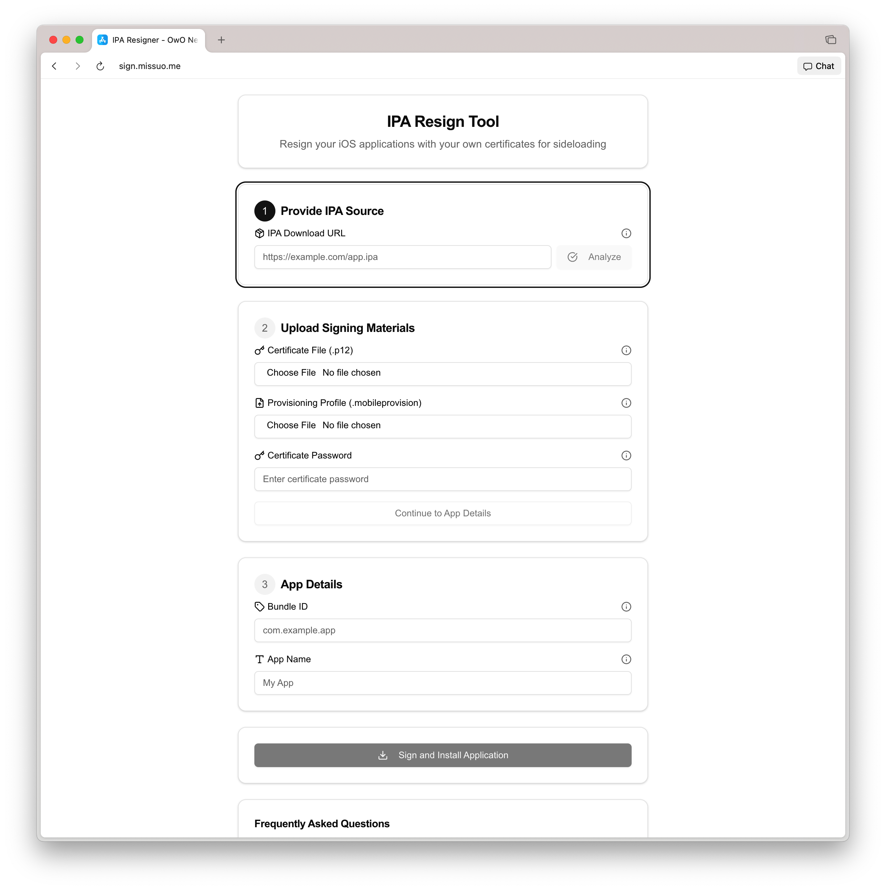

# Resign

IPA online re-sign API service. It can completely replace Esign and Universal-sign.

## Preconditions

[zsign](https://github.com/zhlynn/zsign) must be installed on your deployed server.


## Usage

```bash
go build .
./resign --base_url=https://example.com --port=9900
```

## Demo

[https://sign.missuo.me](https://sign.missuo.me)



Front end is not open source yet. 

You must fill in **all fields** and it does **not support** uploading IPA, so you must use the **correct** and **complete** link.

## License

[BSD-3-Clause](./LICENSE)